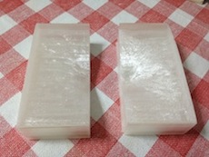
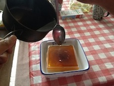

chiriin3d_reverse
=================
これは[地理院地図3D](http://cyberjapandata.gsi.go.jp/3d/)を裏返して型にするプログラムです。3Dプリンタで印刷したのち、お好きなものを流し込みください。   

   

##使い方
pythonコマンドで以下のように実行してください。

```
python chiriin3d_reverse.py dem.stl all > dem_reverse.stl
```

引数部分は、
- 引数1: 地理院地図3Dからダウンロードしたstlデータ
- 引数2: 出力する部分。all(全部)、left(左側)、right(右側) を出力

出力は、stlのテキストを標準出力に書き出すので リダイレクト > でファイルに保存してください。

##3Dプリント
[meshlab](http://meshlab.sourceforge.net/)などでstlデータを確認してください。
left,rightで出力したモデルをそれぞれ3Dプリントしてください。
出力の大きさは、幅が10cmぐらいが最適だと思います。

##ライセンス
本プログラムは[WTFPLライセンス](http://ja.wikipedia.org/wiki/WTFPL)です。    
ただし、地理院地図3Dのデータに関しては、[地理院タイル利用規約](http://portal.cyberjapan.jp/help/termsofuse.html)を参照ください。
