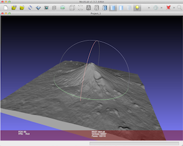
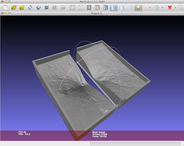
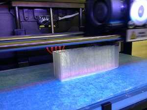
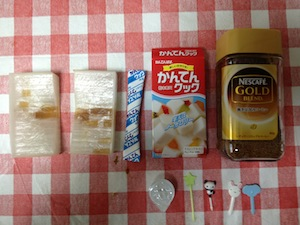
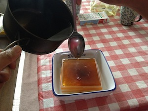
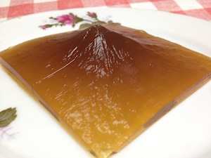
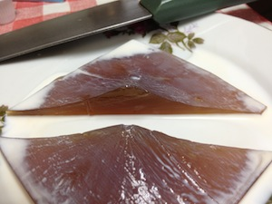
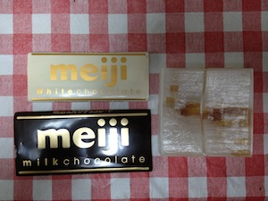
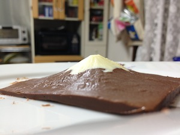

chiriin3d_reverse
=================
これは[地理院地図3D](http://cyberjapandata.gsi.go.jp/3d/)を裏返して型にするプログラムです。3Dプリンタで印刷したのち、お好きなものを流し込みください。   

 

 
 
 

##使い方1

QGIS起動→【プラグイン(p)】→【プラグイン管理とインストール】→【プラグインマネージャ】→【設定】→【プラグインリポジトリ】で以下のURLを追加した後、「Chiriin3D reverse」を有効にしてください。

http://map.ecoris.info/plugins.xml

##使い方2

pythonコマンドで以下のように実行してください。

```
python reverse.py dem.stl dem_reverse.stl all
```

引数部分は、
- 引数1: 地理院地図3Dからダウンロードしたstlデータ名
- 引数2: 出力するstlデータ名
- 引数3: 出力する部分。all(全部)、left(左側)、right(右側) を出力


##3Dプリント
1. [meshlab](http://meshlab.sourceforge.net/)などでstlデータを確認してください。   
2. left,rightで出力したモデルをそれぞれ3Dプリントしてください。出力の大きさは、幅が10cmぐらいが最適だと思います。   

##ライセンス
本プログラムは[WTFPLライセンス](http://ja.wikipedia.org/wiki/WTFPL)です。    
ただし、地理院地図3Dのデータに関しては、[地理院タイル利用規約](http://portal.cyberjapan.jp/help/termsofuse.html)を参照ください。
